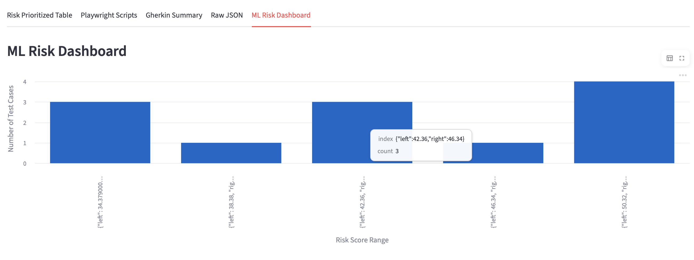

# AI-Powered Test Case Generator & Optimizer

[](https://www.python.org/)
[](https://streamlit.io/)
[](https://groq.com/)
[](https://scikit-learn.org/)
[](https://shap.readthedocs.io/)
[](https://opensource.org/licenses/MIT)

An intelligent web tool that automatically generates high-quality test cases, Playwright automation scripts, and prioritizes them using ML-based risk scoring — built for fintech and SaaS quality engineering.

---

## Key Features

### Core Generation
- Generate **10–15 structured test cases** (Gherkin-style: Given / When / Then) from a plain-English User Story
- Produce **ready-to-run Playwright Python scripts** for the highest-risk scenarios
- Choose between **Llama 3.3 70B**, Llama 3.1 8B, or Mixtral models via Groq API

### ML Risk Intelligence
- Apply **Random Forest ML risk scoring** to every generated test case — predicts a `High / Medium / Low` risk label and confidence score (0–100)
- All test cases are **automatically sorted by descending risk score** so critical tests always surface first
- Interactive **ML Risk Dashboard** with bar charts showing the risk distribution of generated tests

### SHAP Model Explainability
- Dedicated **SHAP Explainability tab** powered by `shap.TreeExplainer`
- Renders a **Waterfall Plot** for any selected test case, showing exactly which features pushed the risk score up or down
- Makes the model fully transparent and interpretable — ideal for QA Architects presenting to engineering leadership

### Batch Backlog Prioritization 
- Upload a **CSV backlog** of any size (e.g., a Jira export) with a `story` or `description` column
- The ML model scores **every row instantly** — no LLM calls needed, no rate limits
- Results table is **interactive**: select the riskiest story and send it directly to the LLM generator with one click
- Download the **`StoryExample.csv`** template from the UI to get started immediately

### Enterprise-Grade Export
- Downloadable **ZIP outputs a full Playwright POM Framework** — not just a loose script:
  - `pages/` — base Page Object Model class
  - `tests/` — LLM-generated test scripts, correctly structured
  - `pytest.ini` — pre-configured pytest setup
  - `requirements.txt` — framework dependencies
  - `.github/workflows/qa-regression.yml` — **GitHub Actions CI pipeline**, ready to push and run

---

## Demo



---

## Quick Start

1. **Clone the repository**
   ```bash
   git clone https://github.com/crisemy/ai-test-generator.git
   cd ai-test-generator
   ```
   > A set of `.sh` helper scripts is provided in the `init-scripts/` folder for quick repo and environment bootstrapping on macOS.

2. **Create and activate a virtual environment**
   ```bash
   python -m venv .venv
   source .venv/bin/activate   # macOS/Linux
   .venv\Scripts\Activate.ps1 or .venv\Scripts\activate    # Windows in pwsh - Otherwise source .venv/Scripts/activate for bash
   ```

3. **Install dependencies**
   ```bash
   pip install -r requirements.txt
   ```

4. **Set up your Groq API key**  
   Create a `.env` file in the project root:
   ```bash
   GROQ_API_KEY=gsk_xxxxxxxxxxxxxxxxxxxxxxxxxxxxxxxxxxxxxxxxxxxx
   ```
   Get a free key at [console.groq.com/keys](https://console.groq.com/keys).

5. **(One-time) Train the risk model**
   ```bash
   jupyter notebook notebooks/risk_model_training.ipynb
   ```
   This generates `data/risk_model.pkl` and `data/label_encoder.pkl`.

6. **Launch the app**
   ```bash
   streamlit run app.py # Or python -m streamlit run app.py to force the .venv path Interpreter
   ```
   Open [http://localhost:8501](http://localhost:8501) in your browser.

---

## Project Structure

```
ai-test-generator/
├── app.py                              # Main Streamlit application
├── assets/
│   ├── logo.svg                        # Brand logo (Dark Forest theme)
│   └── StoryExample.csv                # 10-record sample CSV for batch upload
├── notebooks/
│   ├── risk_model_training.ipynb       # ML training, EDA, and model serialization
│   └── US-priority.ipynb               # Offline batch prioritization demo notebook
├── data/
│   ├── historical_defects.csv          # Training dataset (synthetic fintech defects)
│   ├── risk_model.pkl                  # Serialized RandomForest classifier
│   └── label_encoder.pkl               # Serialized LabelEncoder for risk categories
├── init-scripts/                       # macOS shell scripts for project/venv setup
├── .streamlit/
│   └── config.toml                     # Streamlit dark theme (Dark Forest palette)
├── requirements.txt
├── .env.example
├── .gitignore
└── README.md
```

---

## How It Works

1. **Input** — Paste a User Story in plain English, click a Quick Start example, or upload a CSV backlog.
2. **Batch Filter *(optional)*** — If using CSV mode: the ML model scores the entire backlog instantly. Pick the highest-risk story from the ranked results table.
3. **Generation** — Groq LLM (Llama 3.3 70B) creates 10–15 structured test cases + Playwright scripts for the top risk scenarios.
4. **ML Risk Scoring** — Features are extracted from each test case (financial keywords, security terms, complexity proxies) → the Random Forest predicts the risk label and confidence score.
5. **SHAP Explainability** — Select any test case to view a Waterfall Plot explaining which features drove that prediction. Full model transparency.
6. **Prioritization** — All test cases are ranked by descending risk score in the "Risk Prioritized Table" tab.
7. **Enterprise Export** — Download a production-ready ZIP containing a Playwright POM framework + GitHub Actions CI pipeline ready to push and run.

---

## Tech Stack

| Layer | Technology |
|---|---|
| UI / Frontend | Streamlit |
| LLM | Groq API (Llama 3.3 70B Versatile) |
| ML Model | scikit-learn — `RandomForestClassifier` |
| Explainability | SHAP (`TreeExplainer` + Waterfall Plot) |
| Test Automation | Playwright (Python sync API) |
| Data & Persistence | pandas + joblib |
| CI/CD | GitHub Actions |
| Visualization | Matplotlib |
| Config | python-dotenv |

---

## Requirements

```
streamlit>=1.38.0
groq>=0.9.0
python-dotenv>=1.0.1
pandas>=2.2.0
numpy>=1.26.0
scikit-learn>=1.5.0
shap>=0.40.0
matplotlib>=3.7.0
joblib>=1.4.0
```

---

## Branch Strategy

| Branch | Description |
|---|---|
| `master` | Stable demo — includes SHAP explainability, dark theme, session state persistence |
| `feature/iteration-2-pom-ci-batch` | Iteration 2 — adds Batch CSV prioritization, POM framework generation, and GitHub Actions CI in the downloadable ZIP |

---

## Author

**Cristian N.**

QA Engineer with 20+ years of experience in software testing, automation, and test architecture.  
MSc Candidate in Data Science & Artificial Intelligence.

Research interests:
- Experimental QA engineering & AI-assisted quality assurance
- ML-based defect prediction and risk-based test prioritization
- Data-driven software stability analysis
- QA Architecture & CI/CD integration